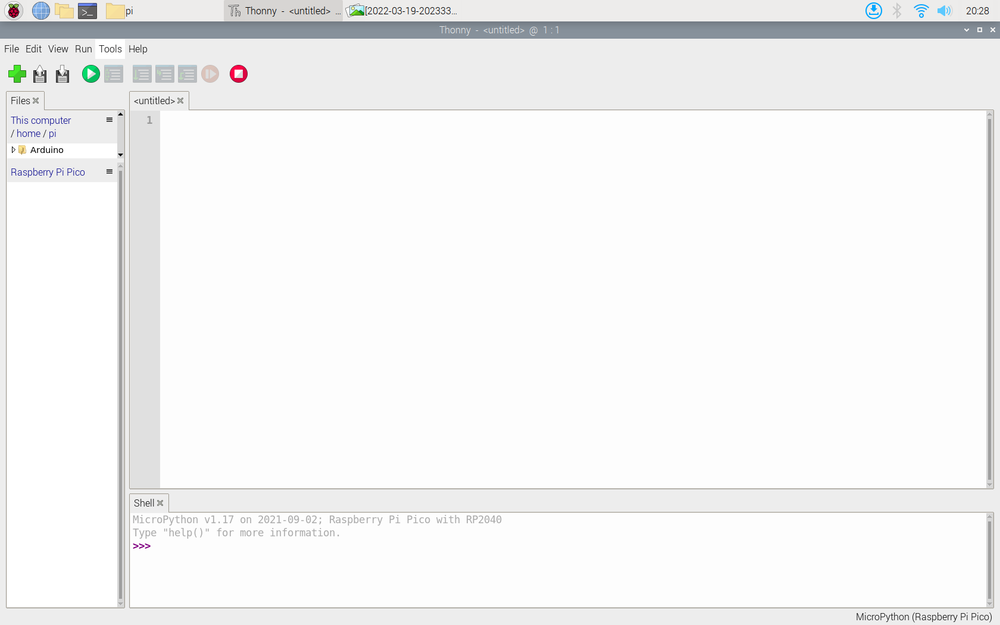
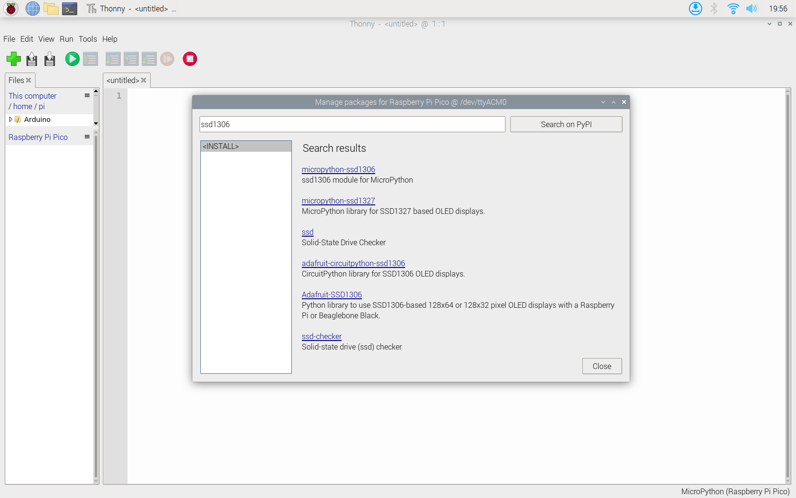
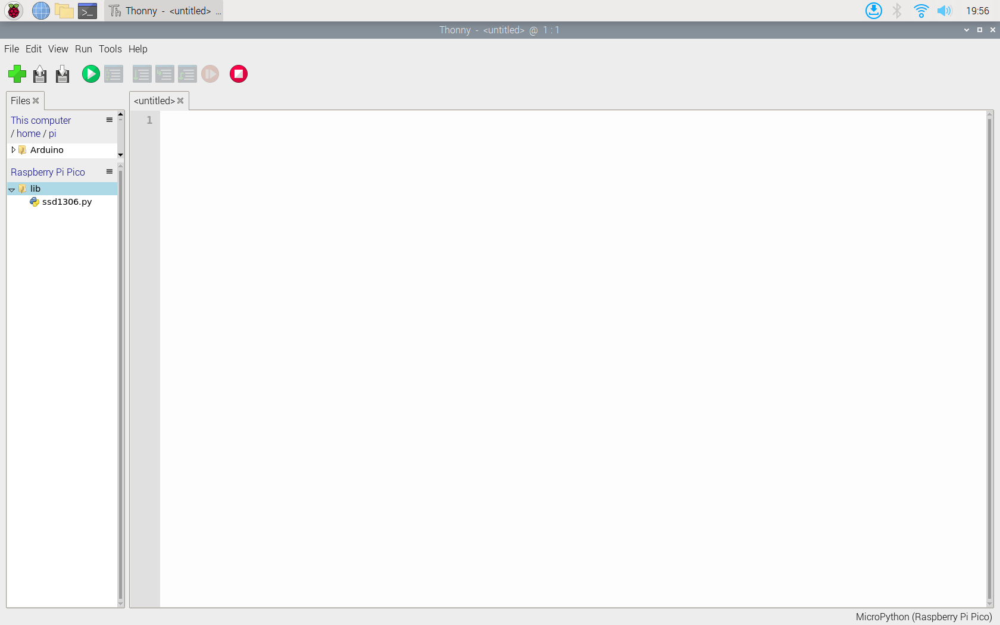
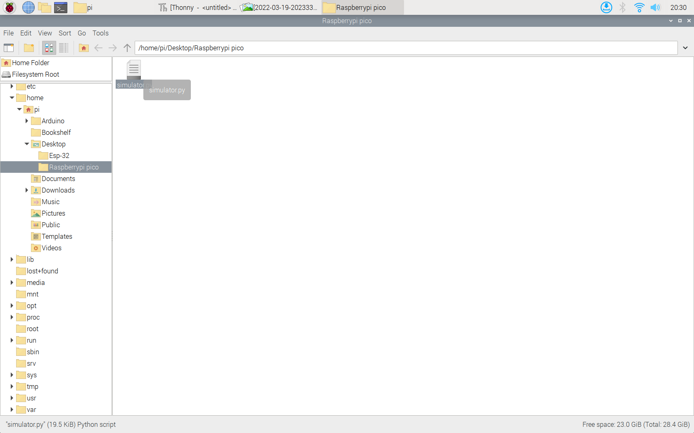
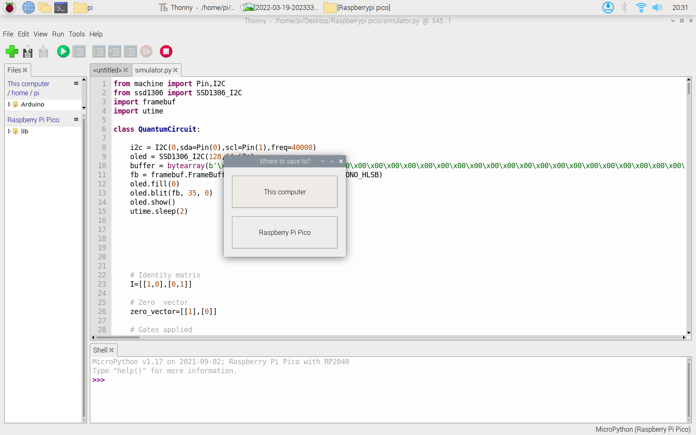
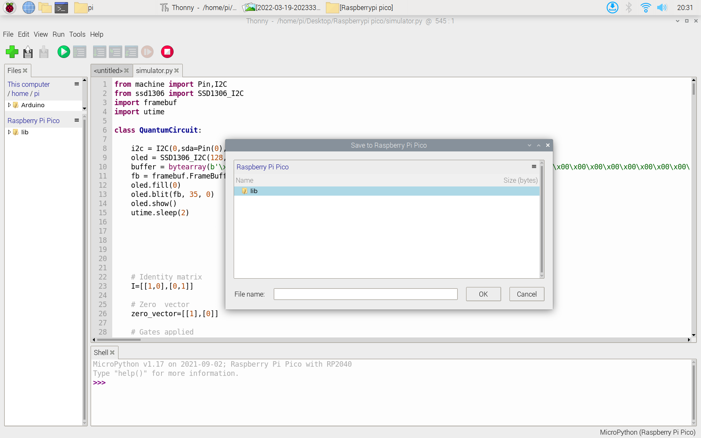
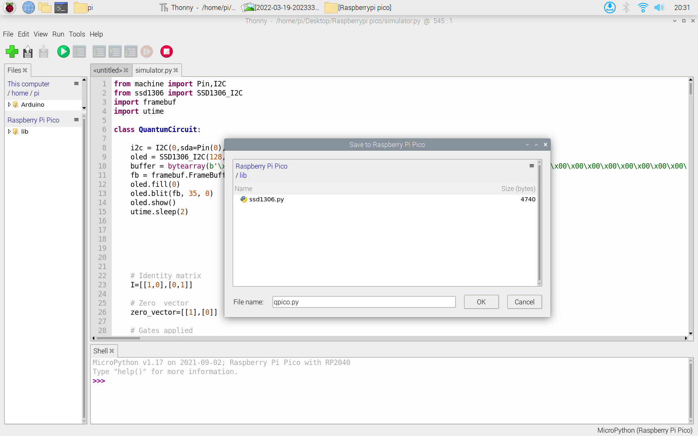
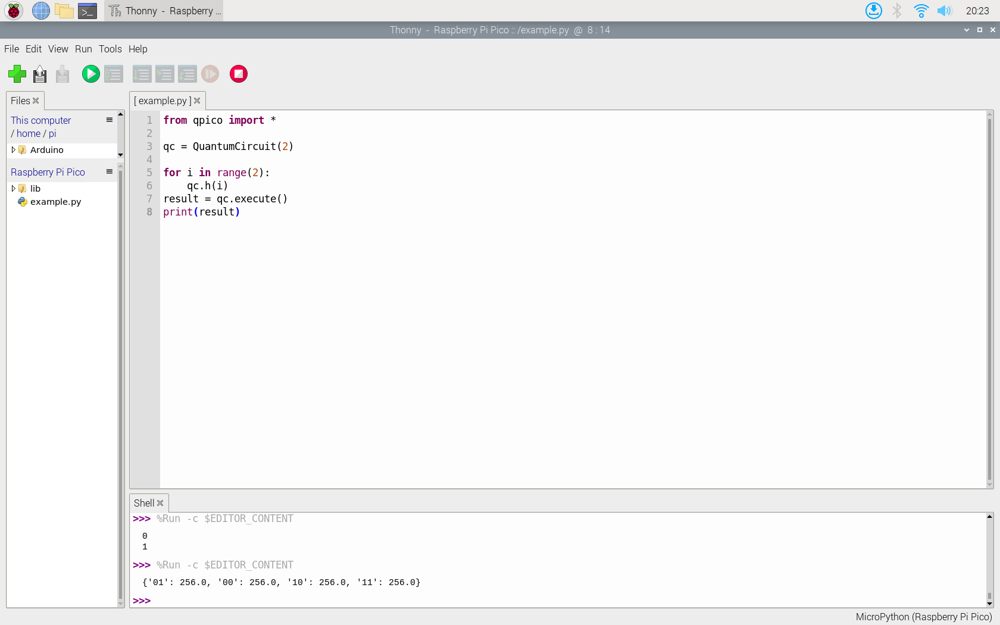

# Qpico
Simulating a Quanutum Computer on Raspberry pi Pico

# What you will need
<ol><li>Raspberry pi pico</li>
  <li>SSD1306 Display module</li>
  <li>Jumper wires</li>
  <li>Bread board</li></ol>

# How to get started!
<ol>
  <li>
    <b>Install Thonny python IDE</b> 
    <ol><li>For Linux <pre><code>sudo apt-get install thonny</code></pre></li>
    <li>For Windows/Mac Download setup from --> <a href="https://thonny.org/">Here</a></li>
    </ol> 
  </li>
  
   <li>
    <b>Install micro python on pico</b> 
    <ol><li>Refer this Video  <a href="https://www.youtube.com/watch?v=_ouzuI_ZPLs">Here</a> </li>
    </ol> 
  </li>

   <li>
    <b>Install libraries for Qpico</b> 
    <ol><li>Click on tools -> manage packages</li>
   

  
      
 <li>Search for ssd 1306 library. Download micropython-ssd1306 library.</li>
  

  
  <li>A lib folder will be created containing ssd1306.py </li>
    
  

  
    
  <li>Download the repository and open the simulator.py with micropython </li>
  

  
    
  <li>Press <code>Ctrl+Shift+s</code> on keyboard</li>
  

  
    
  <li>click save on raspberry pi pico</li>
  

  
  
  <li>Go in the lib folder</li>
  

  
  <li>save in the lib folder as qpico.py</li>
  

  
  <li>Run an example sketch form the repo (Before running the code make the circuit given below)</li>
  

  
    
    
  </ol> 
  </li>
  
  
   
   <li><b>Circuit connections</b> <ol>
    <li>Pin 0 to SDA</li>
    <li>Pin 1 to SCL</li>
    <li>3.3v to VCC</li>
    <li>GND to GND</li>
    </ol> 
  </li>
  
   

  

      
  
  
  <li>
    <b>How to simulate on Qpico</b> 
    <ol><li>create a circuit <code>qc = QuantumCircuit(Number_of_qubits)</code></li>
     <li>Apply Quantum Gates to the Circuit 
  <ul><li>Pauli-X Gate : <code>qc.x(Index_of_Qubit)</code></li>
  <li>Hadamard Gate : <code>qc.h(Index_of_Qubit)</code></li> 
  <li>Pauli-Z : <code>qc.z(Index_of_Qubit)</code></li> 
  <li>Rotation Gate : <code>qc.r(Angle_in_radians,Index_of_Qubit)</code></li> 
  <li>Controll-X Gate : <code>qc.cx(Controll_Index,Target_Index)</code></li>
  <li>Controll-Z Gate : <code>qc.cz(Controll_Index,Target_Index)</code></li>
  <li>Controll-R Gate : <code>qc.cr(Controll_Index,Target_Index)</code></li> 
  <li>Controll-Controll-X Gate : <code>qc.ccx(Controll_Index1,Controll_Index2,Target_Index)</code></li></ul>
  </li> 
    <li>To measure Qubits : <code>qc.execute()</code></li>
    <li>Prints a single unitary matrix : <code>qc.unitary()</code></li>
    <li>Prints the current quantum state of the circuit : <code>qc.state</code></li>
    <li>Prints the probability of the states : <code>qc.prob()</code></li>
    </ol> 
  </li>
  
</ol>

  
  <em>*Currently You can simulate upto 5 Qubits on Qpico.</em> 
